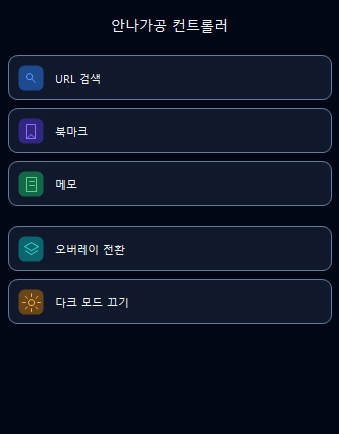

# Overlay URL Memo App
프로젝트 소개

이 프로젝트는 Flutter를 기반으로 제작하는 URL 검색, 북마크, 메모, 오버레이 기능 통합 앱입니다.

사용자는 메인 앱에서 웹사이트 URL을 입력해 접속할 수 있고, 자주 사용하는 사이트를 북마크로 저장할 수 있습니다. 

또한 간단한 메모를 작성, 수정, 삭제할 수 있으며, 앱을 오버레이 형태로 전환하여 
다른 화면 위에서도 주요 기능을 사용할 수 있도록 설계되었습니다.

# 안나가공 컨트롤러

Flutter로 만든 오버레이 기반 컨트롤러 앱입니다.  
메인 앱에서 [URL 검색, 북마크, 메모]를 관리하고,
오버레이 창을 통해 다른 화면 위에서도
웹 검색과 메모 확인을 할 수 있습니다.

## 화면 예시

# 주요 기능
## 1. URL 검색 기능
사용자가 URL을 입력하면 해당 웹페이지로 이동할 수 있습니다.
- URL 입력
- 웹뷰를 통한 페이지 접속

##2. 북마크 기능
자주 사용하는 웹사이트를 북마크로 저장하고 다시 접속할 수 있습니다.
- 현재 URL 북마크 저장
- 저장된 북마크 목록 확인
- 북마크 클릭 시 해당 URL로 접속

##3. 메모 기능
앱 내부에서 간단한 메모를 작성하고 관리할 수 있습니다.
- 메모 작성/수정/삭제
- 저장된 메모 목록 확인
- 오버레이 화면에서 메모 확인

# 5. 오버레이 기능
앱을 오버레이 형태로 전환하여 다른 앱이나 화면 위에서도 사용할 수 있도록 합니다.
오버레이에서는 다음 기능을 사용할 수 있습니다.
- URL 입력 및 접속
- 저장된 북마크 접속
- 메모 확인
- 메인 앱으로 이동

## APK 파일
테스트용 APK 파일은 아래 링크에서 확인할 수 있습니다.

[gimal-debug.apk 바로 다운로드](https://github.com/kds020902/gimal/raw/main/releases/gimal-debug.apk)
